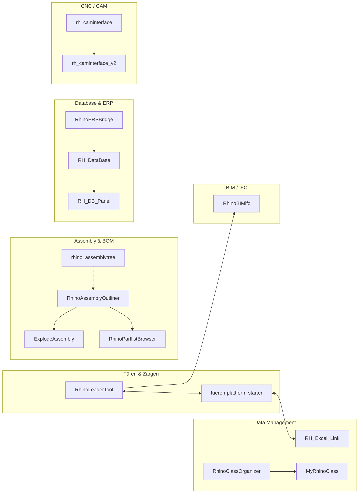

# rhino-dev-hub

> Dashboard for my Rhino 3D / Grasshopper development ecosystem.

<!-- overview starts -->
**27 repos** — 24 public, 3 private

Languages: **C#** (13) · **Python** (5) · **TS** (1) · **HTML** (1)

12 actively developed · 5 experimental
<!-- overview ends -->

---

## Architecture

Beziehungen zwischen den Repos:

---

## Repos by Category

<!-- repos starts -->
### 🚪 Türen & Zargen

| Repo | Description | Language | Last Commit | Rhino | Status | CI |
|------|-------------|----------|-------------|-------|--------|----|
| [RhinoLeaderTool](https://github.com/McMuff86/RhinoLeaderTool) | Leader-Beschriftungen mit UserText (Key/Value) aus CSV für Türen & Zargen | Python | 2025-11-11 | 7/8 |  | — |
| [tueren-plattform-starter](https://github.com/McMuff86/tueren-plattform-starter) | FastAPI + React Plattform für Türen/Zargen-Verwaltung | Python | 2026-01-27 | N/A |  | — |

### 🔩 Assembly & BOM

| Repo | Description | Language | Last Commit | Rhino | Status | CI |
|------|-------------|----------|-------------|-------|--------|----|
| [RhinoAssemblyOutliner](https://github.com/McMuff86/RhinoAssemblyOutliner) | Assembly-Outliner Panel für hierarchische Baugruppen in Rhino | C# | 2026-02-06 | 8 |  | ✅ |
| [rhino_assemblytree](https://github.com/McMuff86/rhino_assemblytree) | Assembly-Tree Datenstruktur und Algorithmen | Python | 2025-08-09 | 8 |  | — |
| [ExplodeAssembly](https://github.com/McMuff86/ExplodeAssembly) | Explosionsdarstellungen für Baugruppen in Rhino | C# | 2025-03-01 | 8 |  | — |
| [RhinoPartlistBrowser](https://github.com/McMuff86/RhinoPartlistBrowser) | Stücklisten-Browser für Rhino-Baugruppen | C# | 2025-03-02 | 8 |  | — |
| [PartPluginforRhino](https://github.com/McMuff86/PartPluginforRhino) | Part-Management Plugin für Rhino | C# | 2025-07-13 | 8 |  | — |

### 🗄️ Database & ERP

| Repo | Description | Language | Last Commit | Rhino | Status | CI |
|------|-------------|----------|-------------|-------|--------|----|
| [RhinoERPBridge](https://github.com/McMuff86/RhinoERPBridge) | Bridge zwischen Rhino und ERP-Systemen | C# | 2025-12-16 | 8 |  | — |
| [RH_DataBase](https://github.com/McMuff86/RH_DataBase) | Datenbank-Anbindung für Rhino-Objekte | C# | 2025-03-14 | 8 |  | — |
| RH_DB_Panel *(private)* | Datenbank-Panel UI für Rhino | — | — | 8 |  | — |
| [RHCoatingApp](https://github.com/McMuff86/RHCoatingApp) | Beschichtungs-Verwaltung und Berechnung | C# | 2025-10-22 | 8 |  | — |

### ⚙️ CNC / CAM

| Repo | Description | Language | Last Commit | Rhino | Status | CI |
|------|-------------|----------|-------------|-------|--------|----|
| [rh_caminterface](https://github.com/McMuff86/rh_caminterface) | CAM-Interface für Rhino (v1) | Python | 2025-08-12 | 7/8 |  | — |
| [rh_caminterface_v2](https://github.com/McMuff86/rh_caminterface_v2) | CAM-Interface für Rhino (v2 — Rewrite) | — | — | 8 |  | — |

### 🤖 AI Integration

| Repo | Description | Language | Last Commit | Rhino | Status | CI |
|------|-------------|----------|-------------|-------|--------|----|
| [GlimpseAI](https://github.com/McMuff86/GlimpseAI) | AI-gestützte Analyse und Erkennung in Rhino | C# | 2026-02-08 | 8 |  | ✅ |
| [rhinomcp](https://github.com/McMuff86/rhinomcp) | Model Context Protocol Server für Rhino 3D | Python | 2026-01-28 | 8 |  | ❌ |

### 📊 Data Management

| Repo | Description | Language | Last Commit | Rhino | Status | CI |
|------|-------------|----------|-------------|-------|--------|----|
| [RH_Excel_Link](https://github.com/McMuff86/RH_Excel_Link) | Bidirektionale Excel-Synchronisation für Rhino (ClosedXML) | C# | 2025-10-12 | 7/8 |  | — |
| [RhinoClassOrganizer](https://github.com/McMuff86/RhinoClassOrganizer) | Klassen-basierte Organisation von Rhino-Objekten | C# | 2025-03-15 | 8 |  | — |
| MyRhinoClass *(private)* | Custom Class-Definitionen für Rhino-Objekte | — | — | 8 |  | — |

### 🏗️ BIM / IFC

| Repo | Description | Language | Last Commit | Rhino | Status | CI |
|------|-------------|----------|-------------|-------|--------|----|
| [RhinoBIMifc](https://github.com/McMuff86/RhinoBIMifc) | BIM/IFC Import und Export für Rhino | TypeScript | 2025-10-15 | 8 |  | ❌ |

### 🔧 Specialized Tools

| Repo | Description | Language | Last Commit | Rhino | Status | CI |
|------|-------------|----------|-------------|-------|--------|----|
| RhinoBend *(private)* | Biegeverformungs-Simulation in Rhino | — | — | 8 |  | — |
| [Moments_of_Inertia](https://github.com/McMuff86/Moments_of_Inertia) | Trägheitsmoment-Berechnung für Rhino-Geometrien | C# | 2025-03-20 | 8 |  | — |
| [QuaderGenerator](https://github.com/McMuff86/QuaderGenerator) | Parametrischer Quader-Generator | C# | 2025-10-27 | 7/8 |  | — |
| [RhinoARViewer](https://github.com/McMuff86/RhinoARViewer) | AR-Viewer Export für Rhino-Modelle | C# | 2026-01-26 | 8 |  | — |
| [RhinoTextExtractor](https://github.com/McMuff86/RhinoTextExtractor) | Text-Extraktion aus Rhino-Dokumenten | — | — | 8 |  | — |

### 🦗 Grasshopper

| Repo | Description | Language | Last Commit | Rhino | Status | CI |
|------|-------------|----------|-------------|-------|--------|----|
| [store_renson_gh](https://github.com/McMuff86/store_renson_gh) | Grasshopper-Definitionen für Renson Store Konfigurationen | — | 2025-03-03 | 7/8 |  | — |

### 🎯 Showcase

| Repo | Description | Language | Last Commit | Rhino | Status | CI |
|------|-------------|----------|-------------|-------|--------|----|
| [rhino_advantages](https://github.com/McMuff86/rhino_advantages) | Showcase: Vorteile von Rhino in der Fertigung | HTML | 2025-08-19 | N/A |  | — |
| [va_template](https://github.com/McMuff86/va_template) | VisualARQ Template für Rhino-Projekte | — | 2025-03-03 | 8 |  | — |
<!-- repos ends -->

---

<!-- updated starts -->
*Last auto-update: 2026-02-10 14:19 UTC*
<!-- updated ends -->
